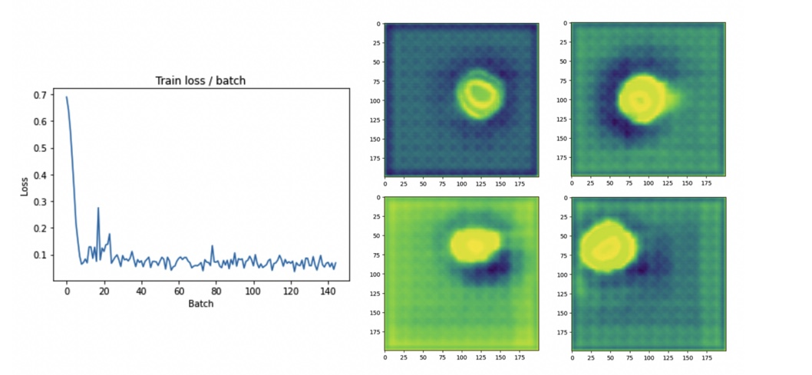
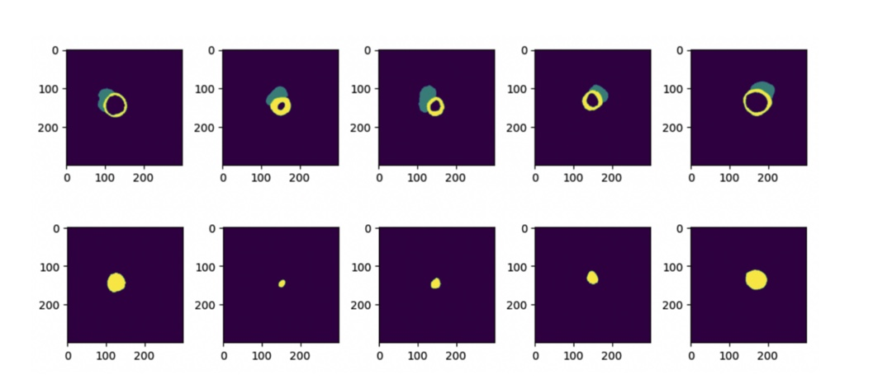

# Cardiac-Pathology-Prediction

The goal of the project is to diagnose four cardiac pathologies using cardiac magnetic resonance
imaging (CMRI). This is a non-invasive method (no biopsy is needed in order to make the diagnostic),
and can be used on a broader range of patients in less time and resources.
These pathologies are myocardial infarction, dilated cardiomyopathy, hypertrophic cardiomyopathy,
and abnormal right ventricle. The task is to classify patients into five categories (the mentioned
pathologies and a normal patient).

## Description

This project (in the form of a kaggle challenge) was conducted as a part of a course; the challenge had also previously taken place (find more information [here](https://www.creatis.insa-lyon.fr/Challenge/acdc/files/tmi_2018_bernard.pdf)).
However, this project had a main difference : in the test set, the left ventricle cavity label (3) is missing (replaced by background), instead of not having any label at all. This provides us with a simple strategy to extract all the other labels (explained in the report).

### Dataset

The dataset used here is [ACDC](https://paperswithcode.com/dataset/acdc).

### Checkpoints for segmentation

Contact me by [email](pegah.khayatan@polytechnique.edu) to get checkpoints.

### Executing program

Execution should be straightforward in colab. Modify the path to the dataset (in drive) accordingly.

### Some results

